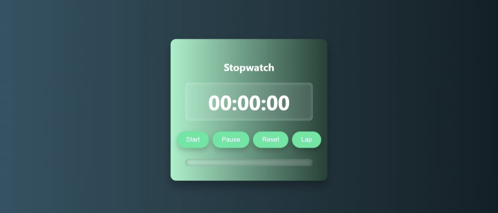
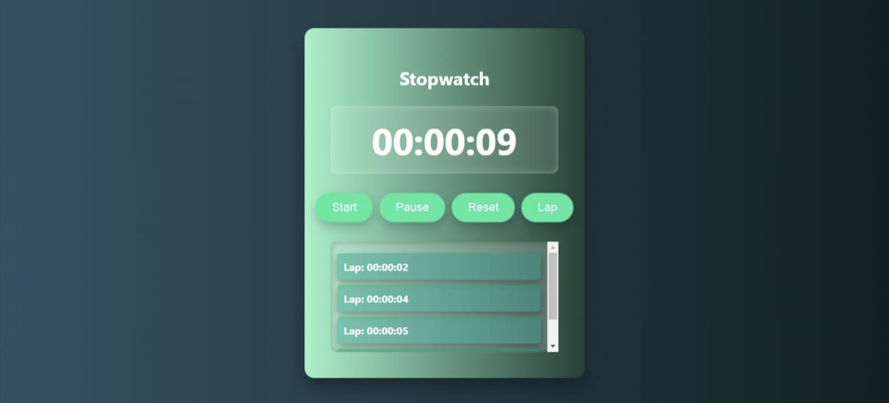

## Stopwatch Application Web-based
# Intro
This is a simple yet interactive web-based stopwatch application that allows users to start, pause, reset, and record lap times
# Usage
- **Start** - to begin the timer.
- **Pause**  - to pause the timer.
- **Reset** -  to clear the timer and lap records.
- **Lap**  - to record the current time.

# Stopwatch at rest

# Stopwatch while running

# Built With
- HTML
- CSS,
- JavaScript
